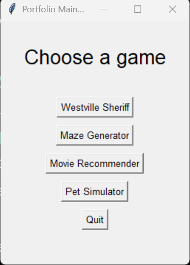

# Personal Portfolio

This is a personal portfolio i created, showing off some of my favorite projects.
## How to use
- Run src/main.py
- Navigate the menus and use the terminal to interact with projects
## Credits
- All the code is by me, BdzUcas
- Lots of testing done by my family and friends